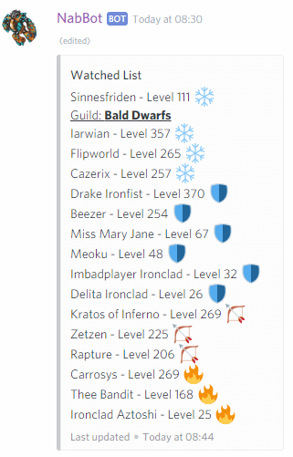

# Watchlist
A watchlist lets you keep track of online characters in a discord channel.
Unlike regular character tracking, entries in watchlists are not tied to a discord user.

Characters and entire guilds can be registered to a watchlist.
Every couple minutes, the message on the watchlist will be updated to show who is currently online, so the channel 
allows you to quickly check who's online. Additionally, the online count is displayed on the channel's name.

Watchlists can be used for anything you want: guildies, friends, enemies, hunting partners, etcetera.

Since v2.0.0, it's possible to have more than one watchlist per server, each watchlist keeps a separate list of entries.

To create a watchlist, you can use the command [`watchlist create`](../commands/tracking.md#watchlist-create).
Once the list is created, it can be managed with the rest of the watchlist subcommands.

All watchlist management subcommands require the user to have `Manage Channel` permissions in the watchlist channel.
So in order to control who can add and delete entries to a watchlist, you need to use the channel's permissions.

In the case of lists subcommands, anyone with permissions to see the channels (`Read Messages`) can use them.
However, this won't stop others from seeing the list if someone else uses the command where they can see.

In order to specify for which watchlist is the command for, the first parameter is the channel's name or mention.

!!! summary "Examples"
    - To add a character to the watchlist named `friends`, use `watchlist add #friends Galarzaa`.  
    - To add a character to the watchlist named `enemies`, use `watchlist add #enemies Nezune`.
    - You can also use the channel's id or a plain name, e.g. `watchlist add 536565071434874880 Galarzaa`.

All available subcommands can be found [here](../commands/tracking.md#watchlist).

